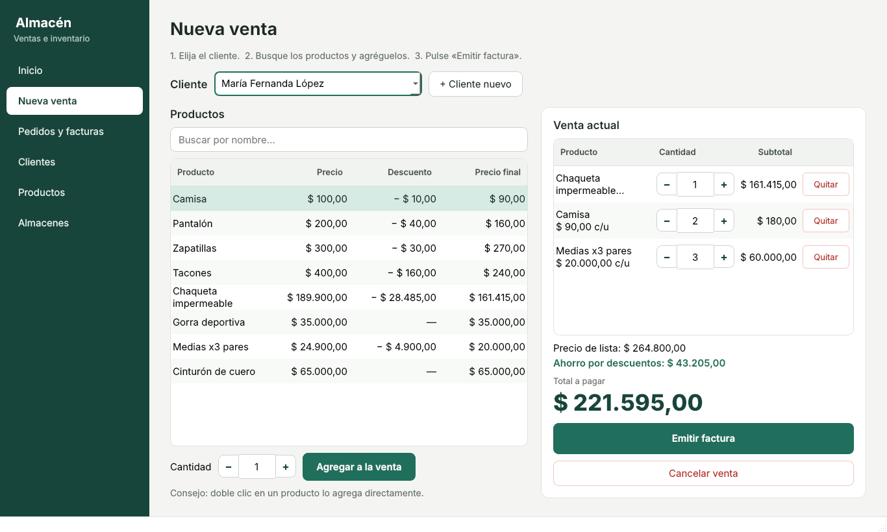
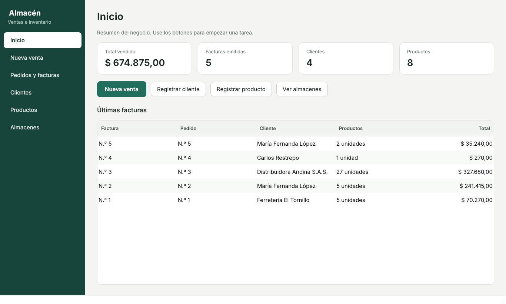
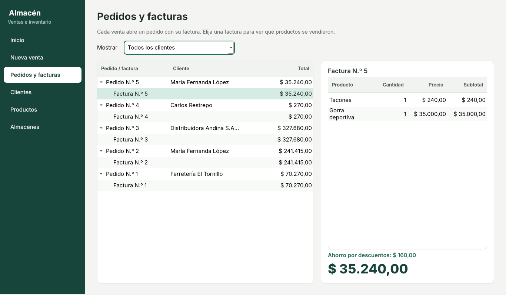
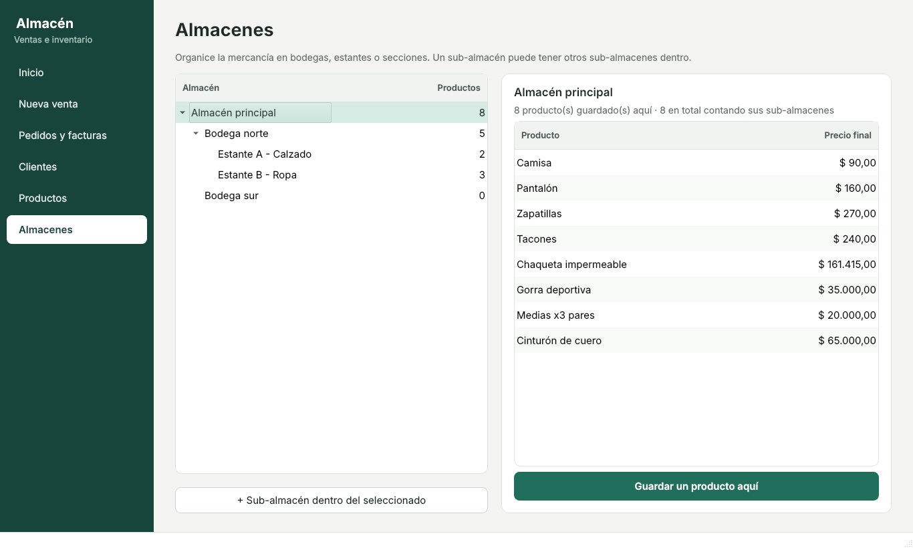
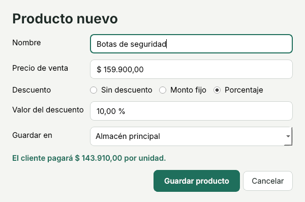
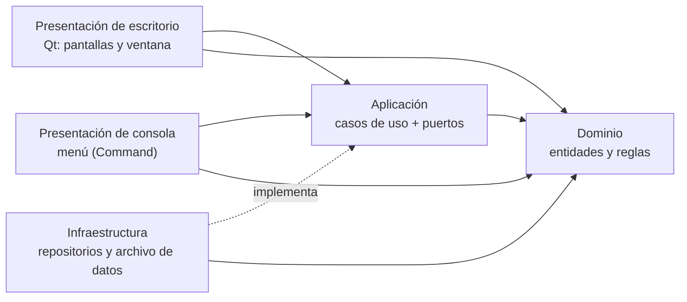

# Sistema de Almacén en C++

[](https://github.com/santyxswc/almacen-c/actions/workflows/ci.yml)


Programa para gestionar **ventas, clientes, productos y almacenes con sub-almacenes**, con una
**aplicación de escritorio** pensada para quien trabaja en el almacén y una versión de consola.
Está escrito en C++17 moderno con **arquitectura limpia**, **principios SOLID** y **patrones de diseño**.



Empezó como un proyecto del curso de Programación Orientada a Objetos y se reescribió para mostrar
cómo organizar un programa pequeño como si fuera un sistema real: capas independientes, reglas del
negocio probadas, sin fugas de memoria y con integración continua en tres sistemas operativos. La
ventana y la consola usan **exactamente los mismos casos de uso**: solo cambia la capa de presentación.

## Qué se puede hacer

| | |
| --- | --- |
| **Vender** | Elegir el cliente, buscar productos, ajustar cantidades con **−** y **+** y emitir la factura. El total y el ahorro por descuentos se ven mientras se arma la venta. |
| **Pedidos y facturas** | Historial de todas las ventas, filtrable por cliente, con el detalle de cada factura. |
| **Clientes** | Registro con número automático y lo que ha comprado cada uno. |
| **Productos** | Catálogo con búsqueda y descuentos **fijos o en porcentaje**; el formulario muestra el precio final mientras se escribe. |
| **Almacenes** | Bodegas, estantes o secciones anidadas a cualquier profundidad, con lo que hay guardado en cada una. |
| **Guardado automático** | Cada cambio se guarda en la carpeta del usuario; al abrir el programa todo sigue ahí. |

| Inicio | Pedidos y facturas |
| --- | --- |
|  |  |
| **Almacenes y sub-almacenes** | **Producto nuevo** |
|  |  |

## Usarlo en Windows (sin instalar nada)

1. En [Releases](https://github.com/santyxswc/almacen-c/releases) descargue `SistemaAlmacen-windows.zip`
   (o, en la pestaña **Actions → Versión para Windows**, el archivo del último resultado).
2. Descomprímalo y abra **`SistemaAlmacen.exe`**.

La primera vez el programa trae cuatro productos de ejemplo. Los datos se guardan solos en
`%APPDATA%\SantiagoCaicedo\SistemaAlmacen\datos-almacen.txt`; para hacer una copia de seguridad basta
con copiar ese archivo.

## Compilar

Requisitos: un compilador con C++17 (GCC 9+, Clang 10+ o Visual Studio 2019+), CMake 3.16+ y, para la
aplicación de escritorio, **Qt 6.4 o superior** (en Ubuntu: `sudo apt install qt6-base-dev`). Sin Qt se
compila igual la versión de consola.

```bash
cmake -S . -B build
cmake --build build --config Release
./build/SistemaAlmacen     # aplicación de escritorio (Windows: build\Release\SistemaAlmacen.exe)
./build/almacen            # versión de consola
```

Pruebas y documentación:

```bash
ctest --test-dir build -C Release --output-on-failure   # 40 pruebas
doxygen Doxyfile                                         # abre docs/api/html/index.html
```

Las capturas de este README se generan con datos de ejemplo:
`cmake --build build --target capturas_escritorio && QT_QPA_PLATFORM=offscreen ./build/capturas_escritorio docs/capturas`.

## Arquitectura



Las dependencias solo apuntan hacia el dominio. La interfaz gráfica se agregó como un adaptador
nuevo sin modificar ninguna regla del negocio, y guardar en un archivo fue una implementación nueva
de infraestructura.

```text
src/
├── dominio/            Reglas puras: Dinero, Producto, PoliticaDescuento, Almacen, Cliente, Pedido, Factura
├── aplicacion/
│   ├── puertos/        Interfaces de repositorio (lo que la aplicación necesita del exterior)
│   ├── casos_uso/      Un caso de uso por clase: CrearFactura, CrearProducto, ConsultarArbolAlmacenes...
│   ├── Dtos.hpp        Datos planos que se devuelven a la presentación
│   └── Mapeo.*         Conversión de entidades a DTOs
├── infraestructura/    Repositorios en memoria, archivo de datos y catálogo inicial
├── presentacion/
│   ├── escritorio/     Ventana, una clase por pantalla, formularios y estilos (Qt)
│   └── (consola)       Consola, vistas, menú y un comando por opción
├── escritorio/         Raíz de composición y punto de entrada de la ventana
├── Aplicacion.*        Raíz de composición de la consola
└── main.cpp
tests/                  Pruebas del dominio, casos de uso, archivo de datos, consola y ventana (Qt Test)
herramientas/           Generador de capturas de pantalla
docs/                   Arquitectura, capturas y UML de la primera versión
```

| Patrón | Uso |
| --- | --- |
| Strategy + Null Object | Descuentos intercambiables (`SinDescuento`, `DescuentoFijo`, `DescuentoPorcentual`) |
| Composite | Almacenes que contienen productos y otros almacenes; la pantalla los muestra como árbol |
| Command | Cada opción del menú de consola es un objeto |
| Observer y Mediator | Las pantallas avisan con señales de Qt; la ventana guarda y actualiza las demás |
| Repository + Inyección de dependencias | Casos de uso independientes del almacenamiento y de la interfaz |
| Aggregate Root y Value Object | `Pedido` protege sus facturas; `Dinero` y `LineaFactura` son inmutables |

El detalle de cada capa, el diagrama de clases y cómo se cumple cada principio SOLID están en
[`docs/ARQUITECTURA.md`](docs/ARQUITECTURA.md).

## Mejoras respecto a la primera versión

| Antes | Ahora |
| --- | --- |
| Solo consola | Aplicación de escritorio para usuarios no técnicos, además de la consola |
| Los datos se perdían al cerrar | Guardado automático en un archivo, a prueba de cortes de luz |
| Había que inventar los números de cliente, pedido y factura | Se asignan solos |
| La factura cobraba el precio sin descuento | La factura usa el precio con descuento y muestra el ahorro |
| `new` sin `delete` (fugas de memoria) | `unique_ptr`/`shared_ptr` y valores; verificado con AddressSanitizer |
| Un solo cliente y un solo pedido a la vez | Muchos clientes, pedidos y facturas |
| Facturas con exactamente 4 productos fijos | Cualquier cantidad de productos; se pueden registrar productos nuevos |
| Dinero en `float` | Objeto de valor `Dinero` en centavos |
| `switch` de 150 líneas en `main` | Menú con patrón Command |
| Inclusiones circulares entre Cliente, Pedido y Factura | Dependencias en una sola dirección |
| Proyecto de ZinjaI | CMake, compila en Linux, Windows y macOS |
| Sin pruebas | 40 pruebas automáticas en CI, incluida la ventana con clics simulados |

## Autor

**Santiago Caicedo** — [@santyxswc](https://github.com/santyxswc)
