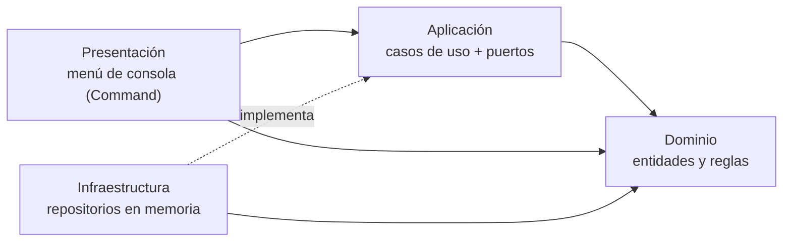

# Sistema de Almacén en C++

[](https://github.com/santyxswc/almacen-c/actions/workflows/ci.yml)


Aplicación de consola para gestionar **clientes, pedidos, facturas y almacenes con sub-almacenes**,
escrita en C++17 moderno con **arquitectura limpia**, **principios SOLID** y **patrones de diseño**.

Empezó como un proyecto del curso de Programación Orientada a Objetos y se reescribió para mostrar
cómo organizar un programa pequeño como si fuera un sistema real: capas independientes, reglas del
negocio probadas, sin fugas de memoria y con integración continua en tres sistemas operativos.

## Características

- Clientes, pedidos y facturas con varios productos y cantidades.
- **Descuentos fijos y porcentuales** que sí se aplican al facturar, con el ahorro visible en cada factura.
- **Almacenes anidados**: sub-almacenes dentro de sub-almacenes, con búsqueda y conteo en todo el árbol.
- Dinero exacto en centavos (sin errores de redondeo de `float`).
- Validación de toda la entrada: un error se muestra y el menú sigue funcionando.
- 31 pruebas automáticas (dominio, casos de uso y menú completo con entrada simulada).

## Demostración

```text
Seleccione una opcion: 4
ID de la factura: 100
ID del pedido: 10
Productos disponibles:
  ID Producto      Precio      Descuento             Precio final
  1  Camisa        $100.00     $10.00 de descuento   $90.00
  2  Pantalon      $200.00     20% de descuento      $160.00
  3  Zapatillas    $300.00     $30.00 de descuento   $270.00
  4  Tacones       $400.00     40% de descuento      $240.00
Escriba el ID de cada producto y su cantidad. Escriba 0 para terminar.
ID del producto (0 para terminar): 1
Cantidad: 2
ID del producto (0 para terminar): 2
Cantidad: 1
ID del producto (0 para terminar): 0
Factura creada con exito:
  Factura 100 (pedido 10)
    Camisa         x2    a $90.00     = $180.00
    Pantalon       x1    a $160.00    = $160.00
    Ahorro por descuentos: $60.00
    Total factura: $340.00
```

## Compilar y ejecutar

Requisitos: un compilador con C++17 (GCC 9+, Clang 10+ o Visual Studio 2019+) y CMake 3.16+.

```bash
cmake -S . -B build
cmake --build build --config Release
./build/almacen            # Windows: build\Release\almacen.exe
```

Pruebas:

```bash
ctest --test-dir build -C Release --output-on-failure
```

Documentación de la API (requiere [Doxygen](https://www.doxygen.nl/)):

```bash
doxygen Doxyfile           # abre docs/api/html/index.html
```

## Arquitectura



Las dependencias solo apuntan hacia el dominio. Cambiar la consola por una interfaz gráfica o la
memoria por una base de datos no toca las reglas del negocio.

```text
src/
├── dominio/          Reglas puras: Dinero, Producto, PoliticaDescuento, Almacen, Cliente, Pedido, Factura
├── aplicacion/
│   ├── puertos/      Interfaces de repositorio (lo que la aplicación necesita del exterior)
│   ├── casos_uso/    Un caso de uso por clase: CrearCliente, CrearFactura, CrearSubAlmacen...
│   ├── Dtos.hpp      Datos planos que se devuelven a la presentación
│   └── Mapeo.*       Conversión de entidades a DTOs
├── infraestructura/  Repositorios en memoria y catálogo inicial
├── presentacion/     Consola, vistas, menú y un comando por opción
├── Aplicacion.*      Raíz de composición (inyección de dependencias)
└── main.cpp
tests/                Marco de pruebas mínimo y pruebas de cada capa
docs/                 Arquitectura y UML de la primera versión
```

| Patrón | Uso |
| --- | --- |
| Strategy + Null Object | Descuentos intercambiables (`SinDescuento`, `DescuentoFijo`, `DescuentoPorcentual`) |
| Composite | Almacenes que contienen productos y otros almacenes |
| Command | Cada opción del menú es un objeto |
| Repository + Inyección de dependencias | Casos de uso independientes del almacenamiento |
| Aggregate Root y Value Object | `Pedido` protege sus facturas; `Dinero` y `LineaFactura` son inmutables |

El detalle de cada capa, el diagrama de clases y cómo se cumple cada principio SOLID están en
[`docs/ARQUITECTURA.md`](docs/ARQUITECTURA.md).

## Mejoras respecto a la primera versión

| Antes | Ahora |
| --- | --- |
| La factura cobraba el precio sin descuento | La factura usa el precio con descuento y muestra el ahorro |
| `new` sin `delete` (fugas de memoria) | `unique_ptr`/`shared_ptr` y valores; verificado con AddressSanitizer |
| Un solo cliente y un solo pedido a la vez | Muchos clientes, pedidos y facturas, consultables por id |
| Facturas con exactamente 4 productos fijos | Cualquier cantidad de productos del catálogo |
| Dinero en `float` | Objeto de valor `Dinero` en centavos |
| `switch` de 150 líneas en `main` | Menú con patrón Command |
| Inclusiones circulares entre Cliente, Pedido y Factura | Dependencias en una sola dirección |
| Fin de entrada dejaba el programa en un ciclo infinito | Cierre ordenado |
| Proyecto de ZinjaI | CMake, compila en Linux, Windows y macOS |
| Sin pruebas | 31 pruebas automáticas en CI |

## Autor

**Santiago Caicedo** — [@santyxswc](https://github.com/santyxswc)
