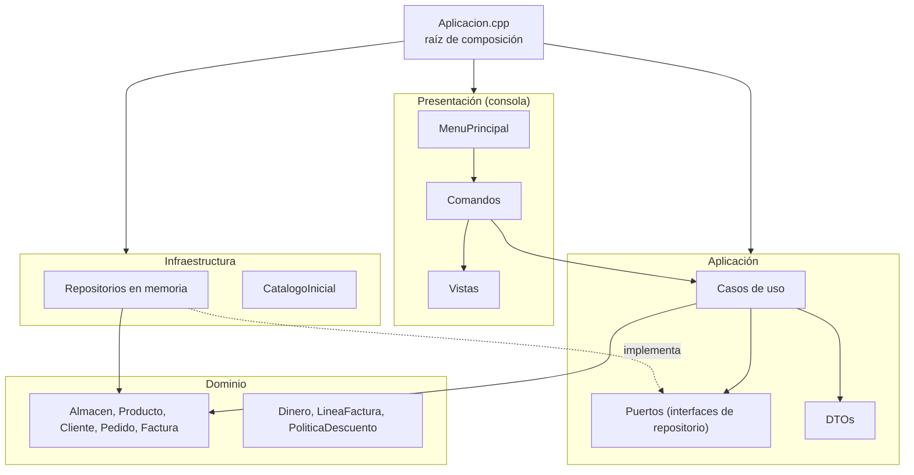
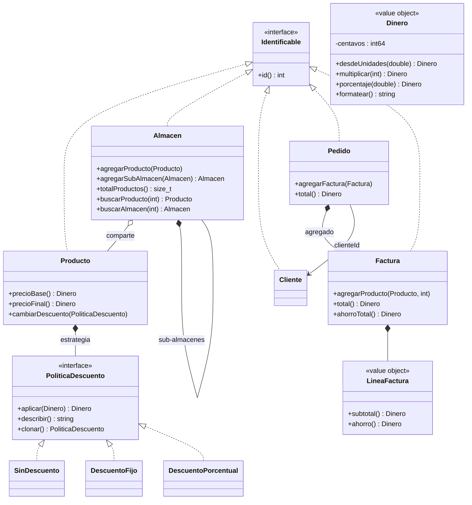

# Arquitectura

Este documento explica cómo está organizado el código y por qué. Está pensado para quien quiera
entender el diseño antes de leer las clases.

## Capas

El proyecto sigue la **arquitectura limpia** (Clean Architecture). El código se divide en cuatro capas
concéntricas y **las dependencias solo apuntan hacia adentro**: el dominio no conoce a nadie, y la
consola o la forma de guardar los datos son detalles que se pueden cambiar sin tocar las reglas del negocio.

| Capa | Carpeta | Responsabilidad | Depende de |
| --- | --- | --- | --- |
| Dominio | `src/dominio` | Reglas del negocio: precios, descuentos, totales, validaciones, árbol de almacenes. | Nadie (solo la biblioteca estándar) |
| Aplicación | `src/aplicacion` | Casos de uso que orquestan el dominio. Define los **puertos** (interfaces) que necesita. | Dominio |
| Infraestructura | `src/infraestructura` | Implementa los puertos: repositorios en memoria y datos iniciales. | Aplicación, Dominio |
| Presentación | `src/presentacion` | Menú de consola: lee datos, llama casos de uso y muestra DTOs. | Aplicación, Dominio |
| Raíz de composición | `src/Aplicacion.cpp` | Crea los objetos concretos y los conecta. | Todas |

## Diagrama de clases del dominio

## Patrones de diseño

| Patrón | Dónde | Qué resuelve |
| --- | --- | --- |
| **Strategy** | `PoliticaDescuento` y sus implementaciones | Antes cada descuento era una subclase de `Producto`. Ahora el descuento es una pieza intercambiable: un tipo nuevo de descuento no obliga a tocar `Producto`. |
| **Null Object** | `SinDescuento` | Un producto siempre tiene política; no hay que preguntar si es nula. |
| **Prototype** | `PoliticaDescuento::clonar()` | Permite copiar un producto con su propio descuento sin conocer el tipo concreto. |
| **Composite** | `Almacen` | Un almacén contiene productos y otros almacenes. Contar, buscar productos o buscar sub-almacenes recorre el árbol completo con la misma interfaz. |
| **Repository** | `RepositorioClientes`, `RepositorioPedidos`, `RepositorioAlmacenes` | Los casos de uso guardan y buscan sin saber dónde viven los datos. |
| **Aggregate Root** (DDD) | `Pedido` | Las facturas solo se agregan a través del pedido, que valida cliente, ids repetidos y facturas vacías. |
| **Value Object** (DDD) | `Dinero`, `LineaFactura` | Valores inmutables comparados por contenido. `LineaFactura` guarda el precio del momento: si el producto cambia después, la factura no. |
| **DTO** | `aplicacion/Dtos.hpp` | La presentación recibe datos planos, nunca entidades que pueda modificar. |
| **Command** | `presentacion/comandos` | Cada opción del menú es un objeto. Reemplaza el `switch` de 150 líneas de la versión anterior. |
| **Factory** | `crearAlmacenConCatalogoInicial()` | Un solo lugar para construir los datos de ejemplo. |
| **Inyección de dependencias** | `Aplicacion.cpp` | Las clases reciben lo que necesitan por constructor; nadie crea sus propias dependencias. |

## Principios SOLID

| Principio | Cómo se aplica |
| --- | --- |
| **S** — Responsabilidad única | Cada caso de uso es una clase con un solo método `ejecutar`. `Consola` solo lee y valida; `Vistas` solo da formato; `MenuPrincipal` solo despacha. |
| **O** — Abierto/cerrado | Un descuento nuevo es una clase nueva que implementa `PoliticaDescuento`. Una opción de menú nueva es un `Comando` nuevo registrado en `Aplicacion.cpp`; `MenuPrincipal` no cambia. |
| **L** — Sustitución de Liskov | Cualquier `PoliticaDescuento` funciona donde se espera una; cualquier implementación de un repositorio funciona con los casos de uso (las pruebas usan las mismas que el programa). |
| **I** — Segregación de interfaces | Un repositorio por agregado, con solo los métodos que los casos de uso usan. `Identificable` exige únicamente `id()`. Cada comando recibe solo los casos de uso que necesita. |
| **D** — Inversión de dependencias | Los casos de uso dependen de interfaces (`puertos/`), no de `std::map` ni de archivos. La infraestructura depende de esas interfaces, no al revés. |

## Errores

- El dominio lanza excepciones que heredan de `ErrorDominio` (`ValorInvalido`, `EntidadNoEncontrada`,
  `EntidadDuplicada`), con mensajes listos para mostrar.
- La consola lanza `EntradaInvalida` cuando el usuario escribe algo que no se puede interpretar, y
  `FinDeEntrada` cuando se cierra la entrada.
- `MenuPrincipal` atrapa todas: muestra el mensaje y el programa sigue funcionando.
- Las operaciones son atómicas: si una factura tiene un producto inválido, el pedido no se modifica.

## Memoria

No hay `new` ni `delete` en el código. Los sub-almacenes pertenecen a su padre (`std::unique_ptr`),
los productos se comparten entre almacenes (`std::shared_ptr<const Producto>`) y el resto son valores.
La CI ejecuta las pruebas con AddressSanitizer para garantizar que no haya fugas ni accesos inválidos.

## Cómo extender

| Quiero... | Hago... |
| --- | --- |
| Un descuento "2x1" | Una clase `DescuentoDosPorUno : PoliticaDescuento`. Nada más cambia. |
| Guardar los datos en archivos o SQLite | Clases nuevas que implementen los puertos de `aplicacion/puertos` y cambiarlas en `Aplicacion.cpp`. Los casos de uso y las pruebas del dominio no cambian. |
| Una interfaz gráfica o web | Una capa de presentación nueva que llame a los mismos casos de uso. |
| Una opción nueva en el menú | Un `Comando` nuevo y una línea `menu.agregar(...)` en `Aplicacion.cpp`. |
